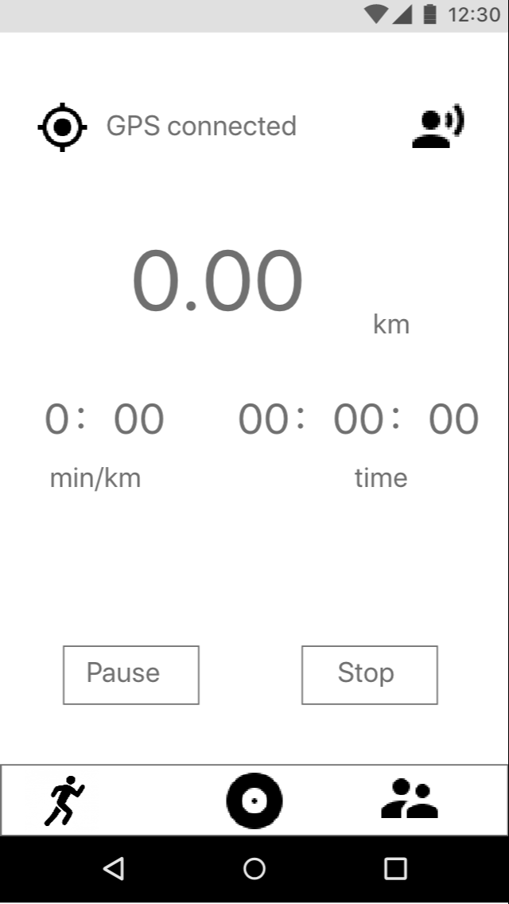
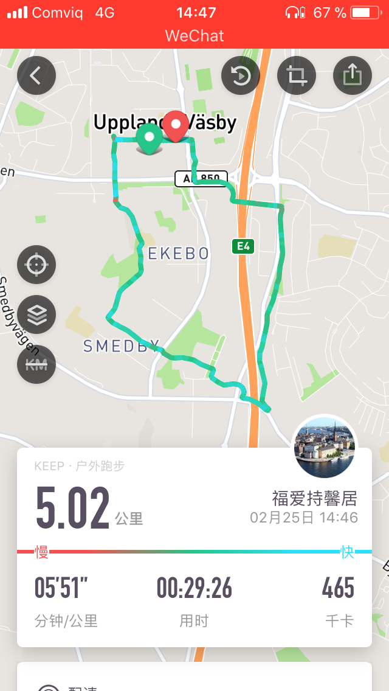
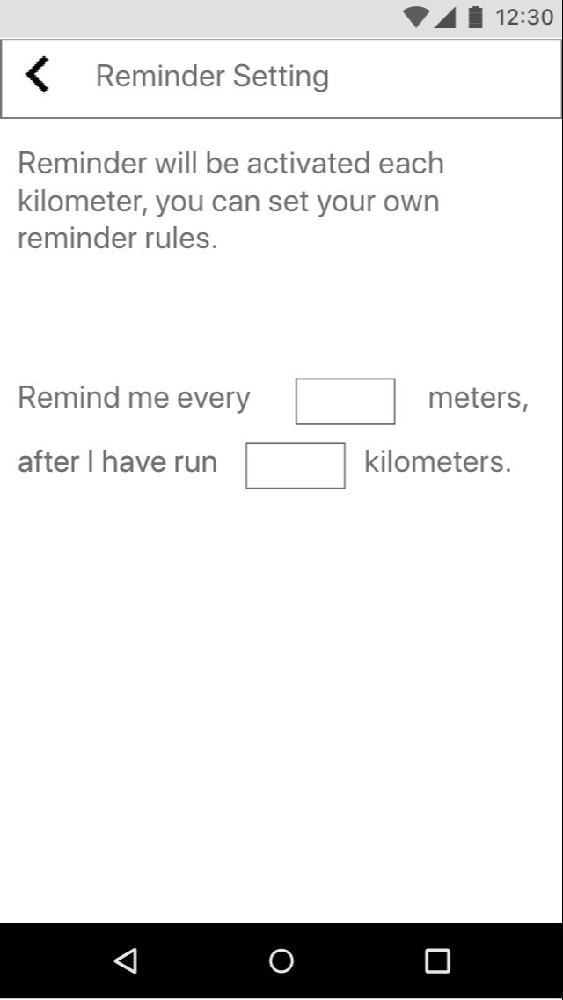
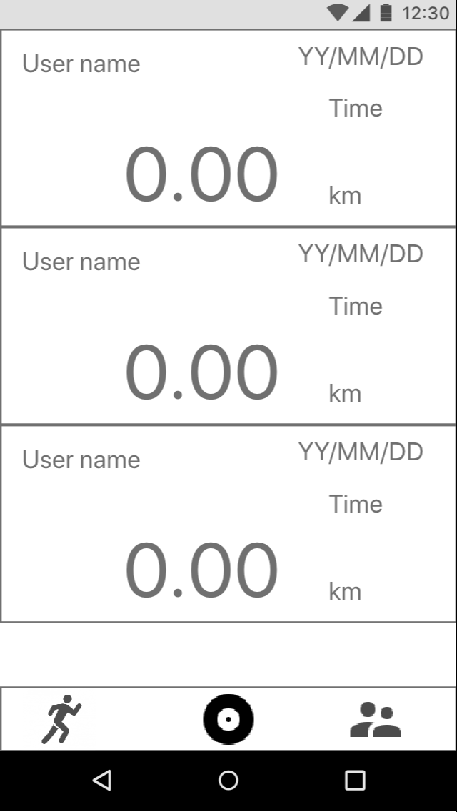
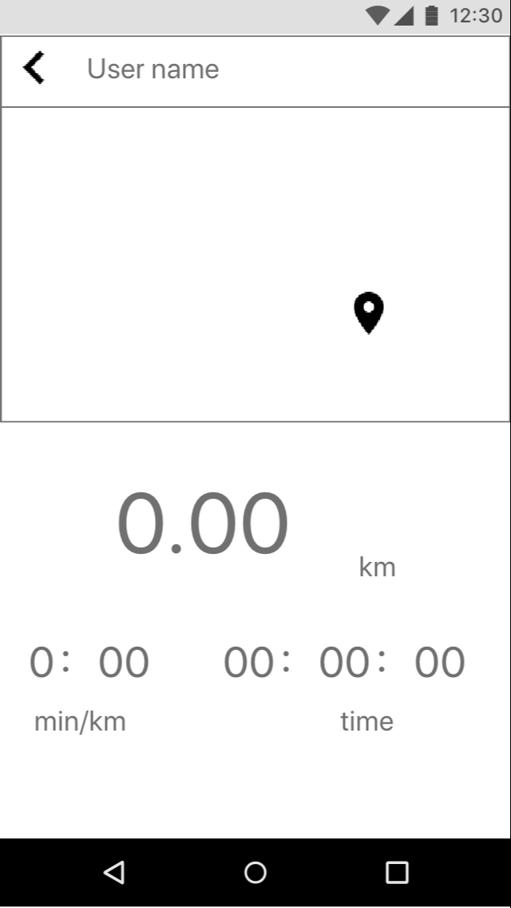

# JoggingCompanion

## Functions planed
 1. Sign in and sign up
 2. Gps tracking
 3. Reminder - SpeechToText
 4. Data sharing
 
### 1.Sign in and Sign up
#### 1.1 Sign in
<image src = "file.md/signIn.PNG" width = 300>
  
#### 1.2 Sign up
<image src = "file.md/signUp.PNG" width = 300>
  
### 2.GPS tracking

#### 2.1 current speed and time duration

#### 2.2 Trace record

### 3.Reminder - SpeechToText

### 4.Data sharing

